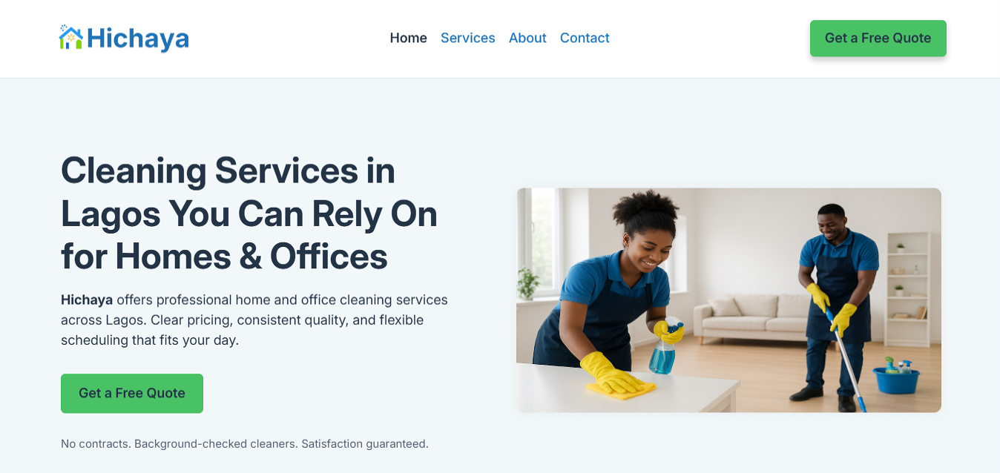
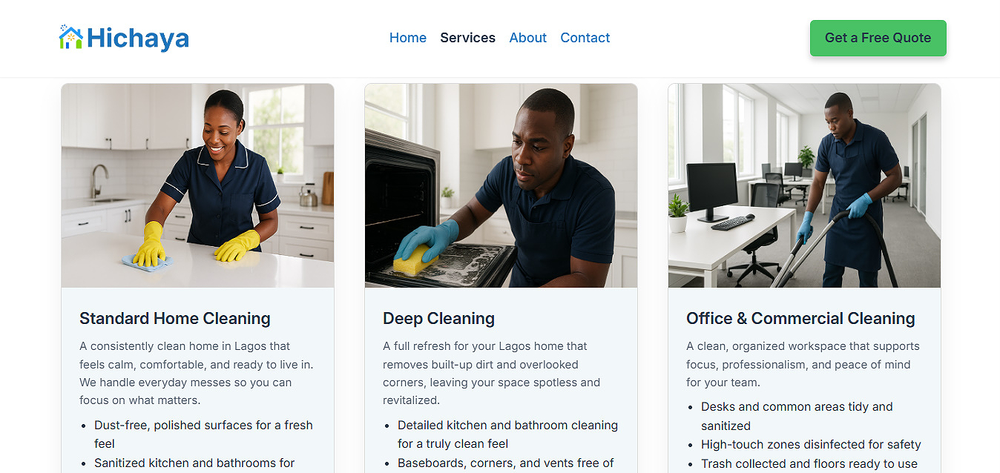

# Hichaya - Cleaning Service Website

**Hichaya** is a responsive and accessible website concept built for a cleaning company. The site showcases services, packages, and booking options for home, office, and short-let cleaning needs.

## 📸 Screenshots:

### Hichaya website Hero section

### Hichaya website Services section

## 🌐 Live Demo:

[View the live site](https://hichaya.vercel.app/)

## Services Highlighted:

- Standard Home Cleaning
- Deep Cleaning
- Office & Workspace Cleaning
- Move-In / Move-Out 
- Post-Construction Cleaning
- Short-Stay / Airbnb Turnover

## 📂 Pages:

- Home – Introduction and company mission
- About – Background and service philosophy
- Services – Detailed breakdown of cleaning packages
- Booking – A booking form for requesting services
- Contact – Additional ways to reach the team

## Technologies Used:

- **HTML5** - structuring website content
- **CSS** - custom styling with Flexbox/Grid, responsive design
- **JavaScript** - interactivity, accordion, and dynamic content
- **AOS.js** - scroll-based animations

## 👤 Author:

**Chijioke Nwabasili**
- Portfolio: [chijiokenwabasili.vercel.app](https://chijiokenwabasili.vercel.app)
